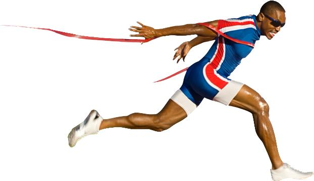
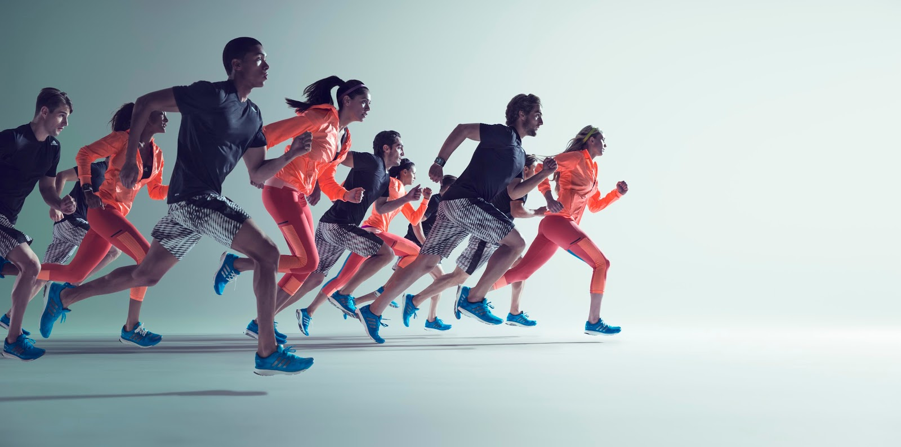

```{r setup, include=FALSE}
library(flexdashboard)
library(ggplot2)
library(paqueteMET)
library(emojifont)
library(lessR)
library(tidyverse)

data("CarreraLuz22")
# subsets-----------------------------------------------------------------------
CarreraLuz22$sex[CarreraLuz22$sex == "M"]="Hombre"
CarreraLuz22$sex[CarreraLuz22$sex == "F"]="Mujer"

CarreraLuz22$nacionalidad[CarreraLuz22$nacionalidad=="0"]="NA"

CarreraLuz22 = subset(CarreraLuz22)
CarreraLuz22M = subset(CarreraLuz22, CarreraLuz22$sex=="Hombre")
CarreraLuz22F = subset(CarreraLuz22, CarreraLuz22$sex=="Mujer")


```


# <b style= 'color:#FFFFFF' >Acerca de la Carrera </b>

Column {data-width=500 .tabset}
-----------------------------------------------------------------------

**Carrera la Luz **  es una de las carreras más tradicionales en Cali la cual consta de 10 Km y participantes desde los 15 años en adelante. La carrera cuenta con diferentes puntos de partida como el Hotel Intercontinental, Calle de la escopeta, museo arqueológico la merced, Museo la tertulia, entre otros. 

```{r, echo=FALSE, out.width="50%", fig.align = "center"}

```

### Clasificación por Nacionalidad
```{r}
nac=aggregate(CarreraLuz22$nacionalidad, list(Sexo = CarreraLuz22$sex, Categoria =CarreraLuz22$categoria, Nacionalidad = CarreraLuz22$nacionalidad), FUN = length) 
names (nac)[4]='Participantes'
nac
```

Column {data-width=500}
-----------------------------------------------------------------------

### Clasificación por Categoría
```{r}
ggplot(CarreraLuz22, aes(x = categoria, fill=sex)) +  geom_bar(position ="dodge2")+
scale_fill_manual(values=c("steelblue","salmon"))
```

### Agrupación por Edad
```{r}
hist(CarreraLuz22$edad, main = "", xlab="Edad (Años)",ylab="Frecuencia" ,col='#00557f')
```


Column {data-width=50 }
-----------------------------------------------------------------------
### participantes {.value-box}
```{r}
valueBox(value = paste(length(CarreraLuz22$id),"atletas"), 
         caption = "Cantidad de participantes",
         icon = "fa-sharp fa-solid fa-person-running",
         col = "#0EB0C6")
```

### tiempo ganador {.value-box}
```{r}
valueBox(value =paste(round(min(CarreraLuz22$timerun/60),1), "min"), 
         caption = "Tiempo del Ganador", 
         icon = "fa-thumbs-up", 
         color = "#0EB0C6")
```

### distancia  {.value-box}
```{r}
valueBox(value = paste(10.07,"Km"), #ud1$min, 
         caption = "Distancia Recorrida", 
         icon = "fa-solod fa-person-walking-arrow-right", 
         color = "#0EB0C6")
```

### Tiempo {.value-box}
```{r}
valueBox(value = paste(round(mean(CarreraLuz22$timerun/60),2),"min"), 
         caption = "Tiempo promedio de carrera", 
         icon = "fa-clock", 
         color = "#0EB0C6")
```

### velocidad  {.value-box}
```{r}
valueBox(value =paste(round(10070/max(CarreraLuz22$timerun),2),"m/s"), # ud1$cierre, 
         caption = "Velocidad Miníma", 
         icon = "fa-clock", 
         color = "#0EB0C6")
```

### velocidad  {.value-box}
```{r}
valueBox(value =paste(round(10070/min(CarreraLuz22$timerun),2),"m/s"), # ud1$cierre, 
         caption = "Velocidad Máxima", 
         icon = "fa-clock", 
         color = "#0EB0C6")
```


# <b style= 'color:#FFFFFF' >Acerca de la Categoría Masculina </b>

Column {data-width=500 .tabset}
-----------------------------------------------------------------------

En la carrera desarrollada en el **Año 2022** participaron **`r paste(length(CarreraLuz22M$id))`** atletas Masculinos siendo la **Categoría Abierta** quien más representantes tuvo y su tiempo de carrera oscilo entre los **50** y **75** minutos en finalizar los 10Km.

El tiempo promedio de carrera para los Hombres fue de **`r paste(round(mean(CarreraLuz22M$timerun/60),2),"min")`**, el mejor tiempo presentado fue de **`r paste(round(min(CarreraLuz22M$timerun/60),1), "min")`** y la categoría que presento mejores tiempos fue la Juvenil con representantes con una edad menor a los 20 años.

### Concentración de tiempo por Categoría

```{r}
C1=ggplot(CarreraLuz22M, aes(y=timerun/60, x=categoria))+
  geom_jitter(color="#447270", size=1, alpha=0.9) +
  labs(title = " ",
       y= "tiempo (min)",
       x= "Categorías")+ 
  ylim(0,170)
C1
```

### Clasificación por Nacionalidad
```{r}
edad1=aggregate(CarreraLuz22M$edad, list( Categoria =CarreraLuz22M$categoria, Nacionalidad = CarreraLuz22M$nacionalidad), FUN = mean) 
names (nac)[3]='Promedio Edad'
edad1
```

Column {data-width=500}
-----------------------------------------------------------------------
### Tiempos por Edad
```{r}
tiempo = CarreraLuz22M$timerun/60
ggplot(CarreraLuz22M, aes(y=edad , x=tiempo))+
facet_wrap(~ categoria)+ 
stat_smooth(method = "loess" , formula =y ~ x)
```

### Tiempo Medio por Categoría
```{r}
ggplot(CarreraLuz22M, aes(x = categoria, y = timerun/60)) +
  geom_boxplot(outlier.colour="blue",color="#447270",fill="gray")+
geom_point(aes(color='Tiempo medio',  x=categoria,y=median(timerun/60) ))
```

Column {data-width=50}
-----------------------------------------------------------------------
### participantes hombres {.value-box}
```{r}
valueBox(value = paste(length(CarreraLuz22M$id),"atletas"), 
         caption = "Cantidad de participantes",
         icon = "fa-sharp fa-solid fa-person-running",
         col = "#0EB0C6")
```

### mejor tiempo h {.value-box}
```{r}
valueBox(value =paste(round(min(CarreraLuz22M$timerun/60),1), "min"), 
         caption = "Mejor Tiempo", 
         icon = "fa-thumbs-up", 
         color = "#0EB0C6")
```

### distancia {.value-box}
```{r}
valueBox(value = paste(10.07,"Km"), #ud1$min, 
         caption = "Distancia Recorrida", 
         icon = "fa-solod fa-person-walking-arrow-right", 
         color = "#0EB0C6")
```

### Tiempo Promedio H {.value-box}
```{r}
valueBox(value = paste(round(mean(CarreraLuz22M$timerun/60),2),"min"), 
         caption = "Tiempo promedio para los Hombres", 
         icon = "fa-clock", 
         color = "#0EB0C6")
```

### velocidad minima H {.value-box}
```{r}
valueBox(value =paste(round(10070/max(CarreraLuz22M$timerun),2),"m/s"), # ud1$cierre, 
         caption = "Velocidad Mínima Hombres", 
         icon = "fa-clock", 
         color = "#0EB0C6")
```

### velocidad Maxima H {.value-box}
```{r}
valueBox(value =paste(round(10070/min(CarreraLuz22M$timerun),2),"m/s"), # ud1$cierre, 
         caption = "Velocidad Máxima Hombres", 
         icon = "fa-clock", 
         color = "#0EB0C6")
```

# <b style= 'color:#FFFFFF' >Acerca de la Categoría Femenina</b>

Column {data-width=400 .tabset}
-----------------------------------------------------------------------

En la carrera desarrollada en el **Año 2022** participaron **`r paste(length(CarreraLuz22F$id))`** atletas Femeninas siendo la **Categoría Abierta** quien más representantes tuvo y su tiempo de carrera oscilo entre los **50** y **75** minutos en finalizar los 10Km.

El tiempo promedio de carrera para los Hombres fue de **`r paste(round(mean(CarreraLuz22F$timerun/60),2),"min")`**, el mejor tiempo presentado fue de **`r paste(round(min(CarreraLuz22F$timerun/60),1), "min")`** y la categoría que presento mejores tiempos fue la Juvenil con representantes con una edad menor a los 20 años.

### Concentración de tiempo por Categoría

```{r}
C2=ggplot(CarreraLuz22F, aes(y=timerun/60, x=categoria))+
  geom_jitter(color="#F6B916", size=1, alpha=0.9) +
  labs(title = " ",
       y= "tiempo (min)",
       x= "Categorías")+ 
  ylim(0,170)
C2
```

### Clasificación por Nacionalidad
```{r}
edad2=aggregate(CarreraLuz22F$edad, list( Categoria =CarreraLuz22F$categoria, Nacionalidad = CarreraLuz22F$nacionalidad), FUN = mean) 
names (nac)[3]='Promedio Edad'
edad2
```

Column {data-width=400}
-----------------------------------------------------------------------
### Tiempos por Edad
```{r}
tiempo2 = CarreraLuz22F$timerun/60
ggplot(CarreraLuz22F, aes(y=edad , x=tiempo2))+
facet_wrap(~ categoria)+ 
stat_smooth(method = "loess" , formula =y ~ x)        
```

### Tiempo Medio por Categoría
```{r}
ggplot(CarreraLuz22M, aes(x = categoria, y = timerun/60)) +
  geom_boxplot(outlier.colour="red",color="orange",fill="#F6B916")+
geom_point(aes(color='Tiempo medio',  x=categoria,y=median(timerun/60) ))
```

Column {data-width=50}
-----------------------------------------------------------------------

### participantes mujeres {.value-box}
```{r}
valueBox(value = paste(length(CarreraLuz22F$id),"atletas"), 
         caption = "Cantidad de participantes",
         icon = "fa-sharp fa-solid fa-person-running",
         col = "#0EB0C6")
```

### mejor tiempo m {.value-box}
```{r}
valueBox(value =paste(round(min(CarreraLuz22F$timerun/60),1), "min"), 
         caption = "Mejor Tiempo", 
         icon = "fa-thumbs-up", 
         color = "#0EB0C6")
```

### distancia  {.value-box}
```{r}
valueBox(value = paste(10.07,"Km"), #ud1$min, 
         caption = "Distancia Recorrida", 
         icon = "fa-solod fa-person-walking-arrow-right", 
         color = "#0EB0C6")
```

### Tiempo Promedio M {.value-box}
```{r}
valueBox(value = paste(round(mean(CarreraLuz22F$timerun/60),2),"min"), 
         caption = "Tiempo promedio para las Mujeres", 
         icon = "fa-clock", 
         color = "#0EB0C6")
```

### velocidad minima M {.value-box}
```{r}
valueBox(value =paste(round(10070/max(CarreraLuz22F$timerun),2),"m/s"), # ud1$cierre, 
         caption = "Velocidad Mínima Mujeres", 
         icon = "fa-clock", 
         color = "#0EB0C6")
```

### velocidad Maxima M {.value-box}
```{r}
valueBox(value =paste(round(10070/min(CarreraLuz22F$timerun),2),"m/s"), # ud1$cierre, 
         caption = "Velocidad Máxima Mujeres", 
         icon = "fa-clock", 
         color = "#0EB0C6")
```

# <b style= 'color:#FFFFFF' >Conclusiones</b>

Column {data-width=500}
-----------------------------------------------------------------------
Para el año 2022 tuvo una asistencia de **`r paste(length(CarreraLuz22$id))`** atletas, donde los representantes Colombianos entre 30 a 40 años fueron quienes tuvieron mayor cantidad de atletas en la carrera, esto seguido por paises como  Alemania y Argentina

Con un **`r paste((round(length(CarreraLuz22M$id)/length(CarreraLuz22$id),4))*100)`** % la Categoría de los hombres fue quien tuvo una mayor representación y quien con **`r paste(round(min(CarreraLuz22M$timerun/60),1), "min")`** fue el mejor tiempo de carrera y el tiempo del Ganador.

La categoría Abierta fue quien agrupo la mayor cantidad de Atletas **(1179 representantes)** y ese mismo resultado se vio en la clasificación por genero, pero la Categoría Juvenil presento los mejores tiempo en el transcurso de la carrera. 

Finalmente, se observa que realizando una comparación entre las Categorías Veteranos A,B y C de las atletas Mujeres con respecto a la mismas Categorías de los hombres, las mujeres presentarón mejor tiempo de carrera ya que tuvieron un tiempo aproximado de 100 minutos mientras que a los hombres les tomo 120 minutos.

```{r, echo=FALSE, out.width="70%", fig.align = "center"}

```
